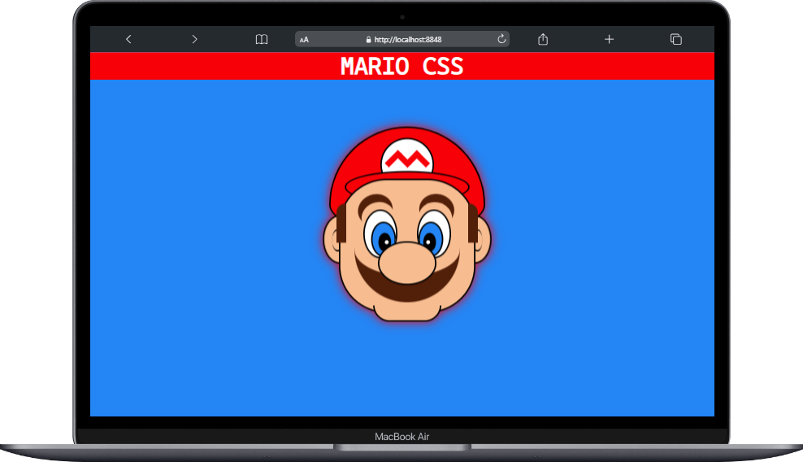

# Proyecto: Dibujo de Mario con HTML y CSS

Este proyecto consiste en crear una representación visual de Mario, el icónico personaje de los videojuegos de Nintendo, utilizando solo HTML y CSS. El objetivo es demostrar la creatividad y habilidades de diseño utilizando tecnologías web básicas.

## Tabla de Contenidos

- [Proyecto: Dibujo de Mario con HTML y CSS](#proyecto-dibujo-de-mario-con-html-y-css)
  - [Tabla de Contenidos](#tabla-de-contenidos)
  - [Descripción](#descripción)
  - [Capturas de Pantalla](#capturas-de-pantalla)
  - [Demo en Vivo](#demo-en-vivo)
  - [Tecnologías Utilizadas](#tecnologías-utilizadas)
  - [Instalación](#instalación)
  - [Configuración](#configuración)
  - [Uso](#uso)
  - [Características](#características)
  - [Contribución](#contribución)

## Descripción

En este proyecto, hemos creado una representación visual de Mario utilizando únicamente HTML y CSS. Mario es un personaje querido por muchos, y este desafío busca mostrar cómo se puede utilizar la creatividad y las habilidades de diseño para recrear personajes icónicos utilizando tecnologías web básicas.

## Capturas de Pantalla

<div align="center">
    
</div>

## Demo en Vivo

Puedes ver la representación de Mario en vivo en el siguiente enlace: [Demo](https://kevinrivera1.github.io/MARIO-HTML-CSS/)

## Tecnologías Utilizadas

- HTML5
- CSS3

## Instalación

No es necesario instalar nada para este proyecto, ya que utiliza solo tecnologías web estándar. Puedes acceder al código fuente directamente desde el repositorio.

## Configuración

No se requiere configuración especial para este proyecto. Solo asegúrate de tener un navegador web moderno para visualizar la representación de Mario.

## Uso

clone el repositorio:

```bash
git clone https://github.com/KevinRivera1/MARIO-HTML-CSS.git
```

Para ver la representación de Mario, simplemente abre el archivo `index.html` en tu navegador web.

También puedes ver la representación de Mario en vivo en la Demo.

## Características

- Representación visual de Mario utilizando solo HTML y CSS.
- Un ejemplo de cómo se pueden utilizar tecnologías web básicas para crear diseños creativos.

## Contribución

Si deseas contribuir o mejorar este archivo HTML:

1. Haz un fork del repositorio.

2. Realiza tus cambios y mejoras en tu propio fork.

3. Envía un pull request para que tus cambios sean revisados y, si se aprueban, se fusionen con el repositorio original.
